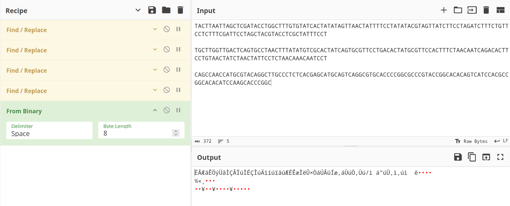
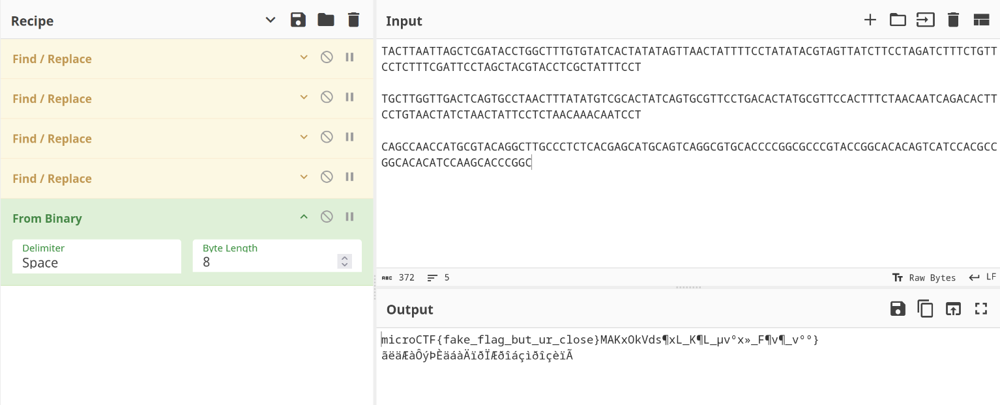
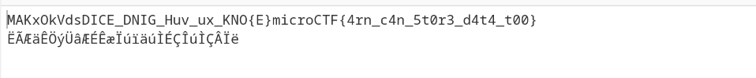

# Description

Ch0up1, an elite cyber security team, injected government secrets into their blood, encoding them into their genes. Now, the government is desperate to capture them and extract this information at any cost, especially one piece of top-secret data.

Author: P1nkm4n
point : 410

# Solution
after we opened the `adn.txt` file we can see that there is three blocks of adn so we can conclude that one of them contain the flag.
we know that the adn representation is
`A = 00 / C = 01 / G = 01 / T = 11`
so i used  to decode those dna's
when we tried nothing appeared,

so maybe the decoding is different. then we know that flag start with microCTF so f we convert m to the binary and compare it with the dna's we can find the write coding.
`m = 01101101` with this our new coding is
`T = 01 / A = 10 / C = 11 / G = 00` now we return to cyber chef to see if we are close.
we can see that we are close the first part gives us a fake flag

lets try with other block
`T = 01 / G = 10 / C = 11 / A = 00` with that coding we found the flag

Flag: `microCTF{4rn_c4n_5t0r3_d4t4_t00}`

