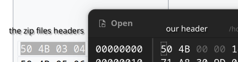

# Description

Do you really think that there is something here?

Author: Suncatcher
point : 230

# Solution
We have a zip file when i tried to extract the file with unzip an error occured `file #1:  bad zipfile offset (local header sig):  0 `
so the file is damaged.
i will use ghex to check his hex code
i searched in the internet for the magic header of the zip files 
i found that the magic header is damaged

after we extact the content we found a gif file

now we need to split all the frames that are in the gif, i used an online gif extractor he gave 6 frames but the last one was the more important he contained a text decoded on base64 `bWIjcm9DVEZ7R2Imc19DNG5fSDFkM19mbDRnc190MDB9`
when we decode it we can see the flag `mb#roCTF{Gb&s_C4n_H1d3_fl4gs_t00}` but its a little bit damaged but we can predict the flag.

Flag: `microCTF{Gifs_C4n_H1d3_fl4gs_t00}`

