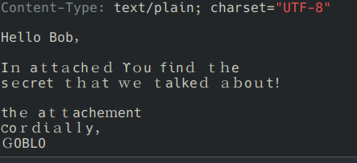
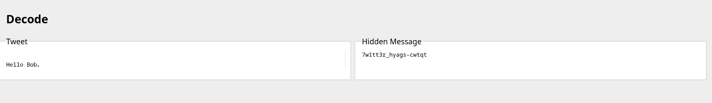

# Description

Mail Analysis. flag should be in this format: microCTF{}

hint : tweets

Author :5ob10
point : 410

# Solution
after we see th email we can notice that the font of the body is a little bit weird

and with the hint we can use a tweet decoder to search for a hiding data in the text i used this
[decoder](https://wulfsige.com/crypto/)

Flag: `microCTF{7w1tt3r_hyags-cwtqt}`

