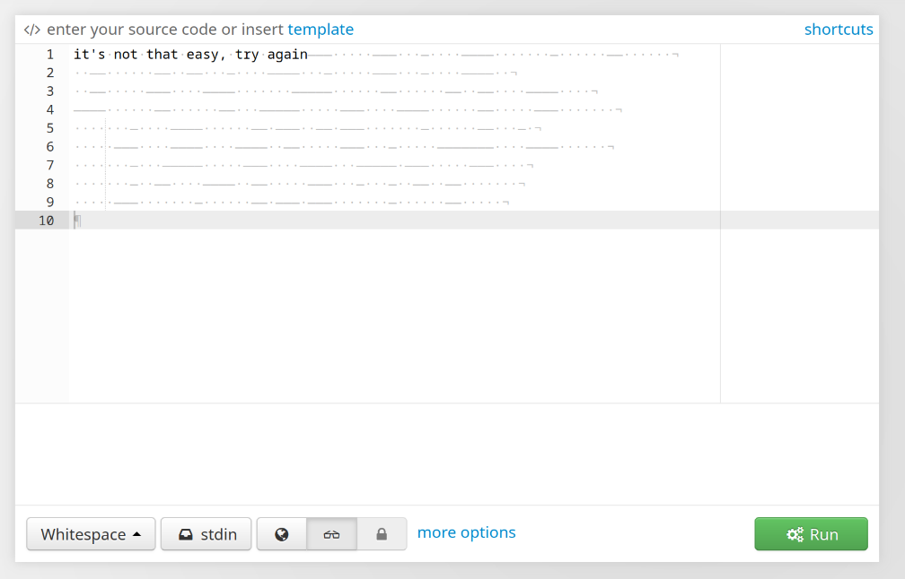

# Description

choupi joined Hogwarts, during a lesson he failed to reveal the flag, can you help him?

Author: B3ll4tr1x
point : 500

# Solution
after i opened the text file it appear that the file contain alot of whitespaces so i thought that maybe it coded in whitespace language when i searched for an interpreter on the net

nothiing appeared after some research i foudn that, there a tool called stegsnow that hide data using whitespace after i used it
`stegsnow -C flag_.txt`
this for arch users install the tar.gz file and put this
`$ snow -C flag_.txt`
i found the flag
Flag: `microCTF{ch0up1_m4$t3ry_4p4r3c1um}`

