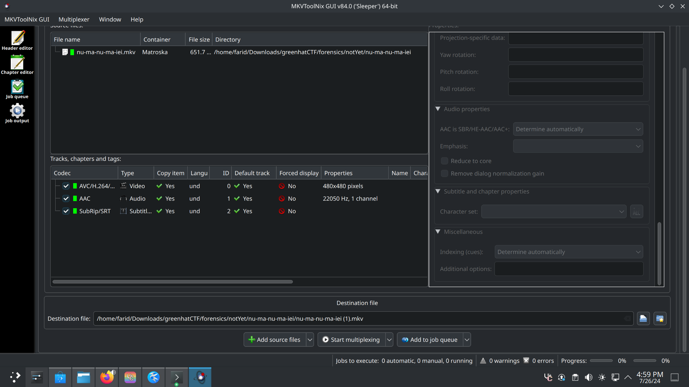
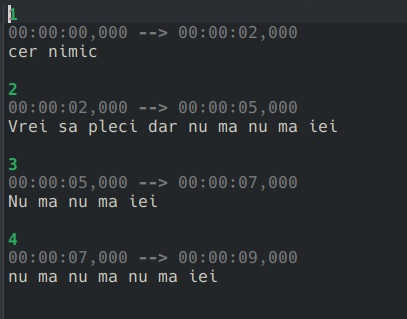
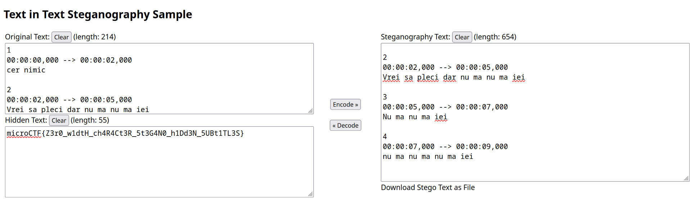

# Description

dancing Zumba With Confidence, cheered on by his adoring grandmother, whose support shines brighter than the sun

Author: P1nkm4n
point : 410

[video](nu-ma-nu-ma-iei.mkv)

# Solution
i used `exiftool` at the video and `mkvmerge v85.0 ('Shame For You') 64-bit` appeared .This suggests that the video file was created or modified using this particular version of the mkvmerge tool.
after i extract all the layers using mkvtoolnix gui

To obtain the correct subtitle format and data, we can use the ffmpeg tool with the following command:
`ffmpeg -i nu-ma-nu-ma-iei.mkv -map 0:s:0 subs.srt`
here the content of the file

we can see in the description that the letter Z W C are written in capital suggest the use of these zero-width characters. They might have been used to hide extra information within the subtitle file
search for a “zero width character decoder.” This tool can help you decode and reveal any hidden information hidden using zero-width characters: [ZWC decoder](https://330k.github.io/misc_tools/unicode_steganography.html)
after that i copied the subtile and decoded it using that tool and i found the flag

Flag: `microCTF{Z3r0_w1dtH_ch4R4Ct3R_5t3G4N0_h1Dd3N_5UBt1TL3S}`

