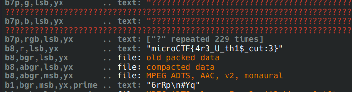

# Description

Anya loves playing her favorite game of being a spy, and this time she's hidden a secret message using steganography. Decode these "Little Spy Blurbs" to uncover Anya's secret mission. A spy...this is so exciting! Waku Waku! Good luck, agent! 
Author: B3ll4tr1x

# Solution

The key to solving this challenge was in the name “Little Spy Blurbs.” Observing the capitalization pattern of the first letters in each word reveals the acronym "LSB," which stands for Least Significant Bit in the realm of steganography. This clue pointed us towards a common method used for hiding information in images.

To extract the hidden message, we utilized the tool zsteg, which is specifically designed to analyze and extract information from images encoded with the Least Significant Bit technique.
`zsteg -a waku-waku.png`
the first thing appeared was a sentence encoded in ROT13: `abguvat_gb_frr_urer`. Decoding this with ROT13 revealed the phrase "nothing_to_see_here."
after scrolling we can see the flag

Flag: `microCTF{4r3_U_th1$_cut:3}`

