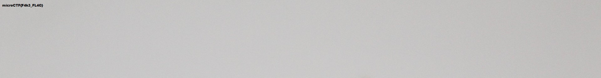
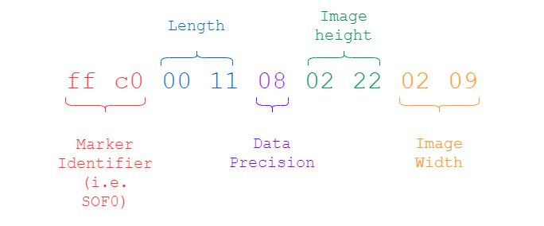
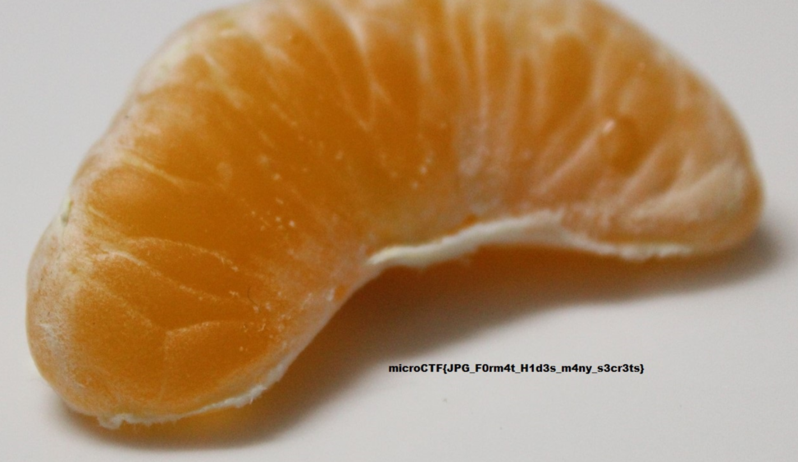

# Description

Sometimes, focusing too much on something can make you miss the broader picture.

Author: Suncatcher
point : 500

# Solution
the first thing we see is a fake flag on the pic.
i tried strings, binwalk, exiftool nothing interesting
after i focus on the description i got interested with broader picture so maybe the picture is croped.
and we can notice that maybe the height of the picture.
i used ghex to change the bits of the height

i changed it to

after that we can see the piece of the mandarine with the flag

Flag: `microCTF{JPG_F0rm4t_H1d3s_m4ny_s3cr3ts}`

